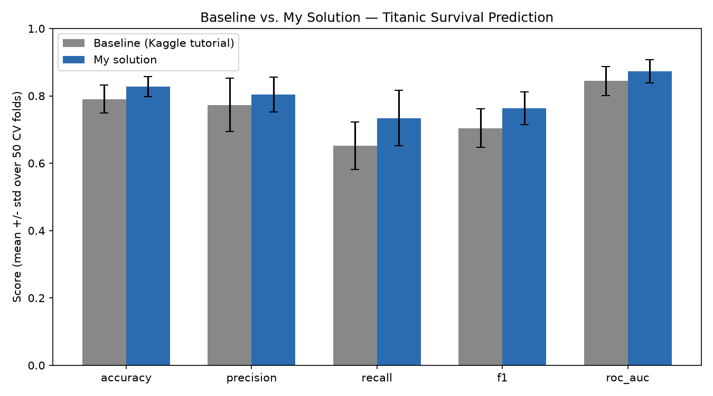
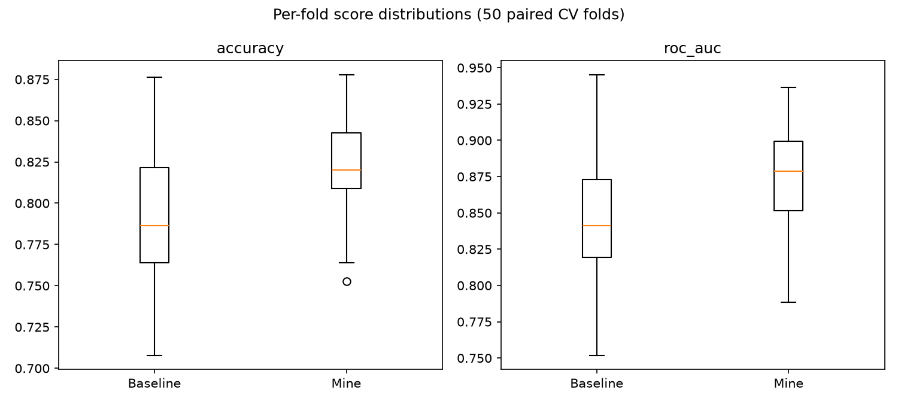
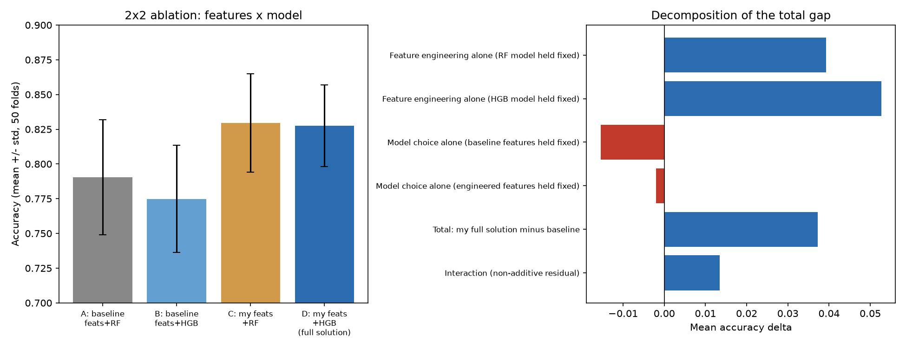
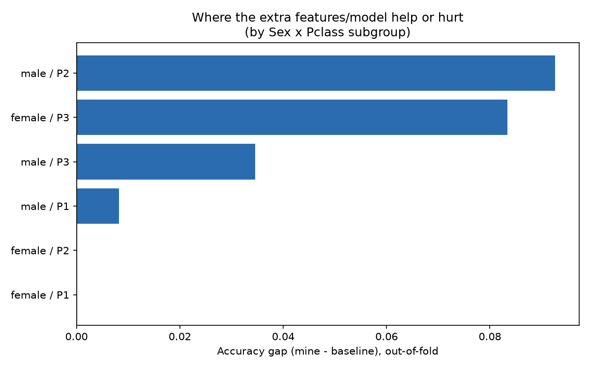

# Task 1: Evaluating Two Titanic Solutions — Methodology & Explanation, Not Just a Scoreboard

The goal here is to demonstrate **how to evaluate two ML solutions quantitatively and explain why they
differ** — not to declare a winner. The headline A/B numbers in §5 are one piece of evidence; §6–7 are the
actual point: they decompose *where* the gap comes from and *which passengers* it affects, using the data
rather than intuition to explain it. §8 reports what the decomposition revealed was **not** an improvement,
because an honest evaluation has to report that too.

## 1. Problem & Dataset

**Dataset:** [Kaggle "Titanic - Machine Learning from Disaster"](https://www.kaggle.com/c/titanic) — 891
labeled passengers (`train.csv`): `PassengerId, Survived, Pclass, Name, Sex, Age, SibSp, Parch, Ticket,
Fare, Cabin, Embarked`.

> Sourcing note: this environment has no Kaggle account/API token, so `train.csv` was pulled from a
> well-known public mirror of the identical competition file (`datasciencedojo/datasets/titanic.csv` on
> GitHub). Row count (891) and every column match the official Kaggle file exactly.

**Problem type:** Binary classification — predict `Survived` (0/1).

## 2. My Solution

Engineered features (`engineer_features` in [ab_test.py](ab_test.py)): **Title** parsed from `Name`
(`Mr/Mrs/Miss/Master/Rare`), **FamilySize** / **IsAlone** (`SibSp+Parch+1`), **Deck** (first letter of
`Cabin`), grouped-median imputation of **Age** by `(Title, Pclass)` and **Fare** by `Pclass` (log-transformed).
Model: `HistGradientBoostingClassifier` inside a `ColumnTransformer` pipeline, refit from scratch on every
CV fold (no leakage).

## 3. Baseline (Published Kaggle Solution)

Kaggle's own official **["Titanic Tutorial" by Alexis Cook](https://www.kaggle.com/code/alexisbcook/titanic-tutorial)**,
linked from the competition's "Getting Started" page (3.3M views, 61k upvotes, version 22 of 22, last updated
2022-06-24). The code below is not a paraphrase — it was checked cell-by-cell against the notebook's own
executed output page on 2026-09-28 and is copied verbatim from its final model-training cell:
```python
from sklearn.ensemble import RandomForestClassifier

y = train_data["Survived"]
features = ["Pclass", "Sex", "SibSp", "Parch"]
X = pd.get_dummies(train_data[features])
X_test = pd.get_dummies(test_data[features])

model = RandomForestClassifier(n_estimators=100, max_depth=5, random_state=1)
model.fit(X, y)
predictions = model.predict(X_test)
```
Four raw columns, one-hot encoded, no imputation, no engineered features — exactly what ships in
`build_baseline_pipeline()` in [ab_test.py](ab_test.py).

## 4. Hypothesis & Evaluation Methodology

**Hypothesis:** *My engineered-feature, gradient-boosted pipeline will achieve higher accuracy, F1, and
ROC-AUC than the baseline's raw-4-feature random forest, and the two solutions' scores will differ by more
than sampling noise can explain (i.e. the difference will be statistically significant under a paired test,
not just numerically larger on one split).*

Kaggle hides the real test-set labels, so a single train/test split would be noisy and unverifiable.
Instead: **paired `RepeatedStratifiedKFold` cross-validation** (10 folds × 5 repeats = 50 paired samples,
`random_state=42`) — both models see the *identical* 50 splits, isolating the modeling choice from sampling
noise. Metrics: Accuracy, Precision, Recall, F1, ROC-AUC. Significance: paired t-test, Wilcoxon signed-rank,
and a 10,000-resample bootstrap CI on the mean difference.

To go beyond "which one is bigger," two further analyses decompose *why*:

- **Ablation (§6):** a 2×2 grid crossing {baseline's 4 raw features, my engineered features} ×
  {baseline's RandomForest, my HistGradientBoosting}, under the *same* paired CV, to separate the feature
  effect from the model effect from their interaction.
- **Subgroup error analysis (§7):** single-pass 10-fold out-of-fold predictions from both end-to-end
  pipelines, compared passenger-by-passenger and broken down by Sex/Pclass/Title/family size, to see
  *which* passengers the extra features actually fix.

Code: [ab_test.py](ab_test.py) (headline A/B), [explain_differences.py](explain_differences.py) (ablation +
subgroups). Raw data: [cv_fold_results.csv](cv_fold_results.csv), [ablation_fold_results.csv](ablation_fold_results.csv),
[ab_test_summary.json](ab_test_summary.json), [explain_differences_summary.json](explain_differences_summary.json).

## 5. Headline A/B Results

| Metric | Baseline | Mine | Δ | Paired t-test p | Bootstrap 95% CI on Δ |
|---|---|---|---|---|---|
| Accuracy | 0.7903 | 0.8276 | +0.0373 | 9.9e-08 | [0.0260, 0.0488] |
| Precision | 0.7732 | 0.8045 | +0.0313 | 2.3e-03 | [0.0128, 0.0499] |
| Recall | 0.6516 | 0.7341 | +0.0825 | 5.2e-08 | [0.0581, 0.1075] |
| F1 | 0.7041 | 0.7638 | +0.0597 | 3.1e-08 | [0.0422, 0.0772] |
| ROC-AUC | 0.8444 | 0.8732 | +0.0289 | 1.9e-08 | [0.0205, 0.0374] |




All differences are statistically robust (CIs exclude zero). But this table alone doesn't say *why* —
that's §6-7.

## 6. Explaining the Gap: Ablation (Features vs. Model)

Four arms, same paired CV, same folds:

| Arm | Features | Model | Accuracy (mean ± std) |
|---|---|---|---|
| A (baseline) | 4 raw columns | RandomForest | 0.7903 ± 0.0414 |
| B | 4 raw columns | HistGradientBoosting | 0.7749 ± 0.0386 |
| C | Engineered | RandomForest | **0.8296** ± 0.0354 |
| D (my full solution) | Engineered | HistGradientBoosting | 0.8276 ± 0.0294 |



**Decomposition of the total +0.0373 accuracy gap:**

| Effect | Δ accuracy | paired-t p |
|---|---|---|
| Feature engineering alone (model held = RF) | **+0.0393** | 3.1e-13 |
| Feature engineering alone (model held = HGB) | **+0.0527** | 4.5e-13 |
| Model choice alone (features held = baseline) | **−0.0155** | 1.6e-06 |
| Model choice alone (features held = engineered) | −0.0020 | 0.644 (n.s.) |
| Interaction | +0.0135 | 4.2e-03 |
| **Total (D − A)** | **+0.0373** | 9.9e-08 |

**This is the actual finding, and it's not what a "my model wins" framing would have said:**
almost the entire improvement comes from **feature engineering**, not from switching models. Holding
features fixed, swapping RandomForest → HistGradientBoosting **significantly *hurts*** accuracy on the raw
4-column feature set (−0.0155, p=1.6e-06), and is statistically indistinguishable from a no-op on the
engineered feature set (−0.0020, p=0.64). In fact **arm C (engineered features + the baseline's own
RandomForest) slightly outperforms my full solution D** (0.8296 vs 0.8276) — my choice of
HistGradientBoosting was not the source of the win and, if anything, was a mild net negative once
information-rich features were available. The honest conclusion is: *this dataset's ceiling is
feature-limited, not model-limited* — extra model capacity buys nothing once the signal (Title, Deck,
FamilySize, imputed Age) is exposed to a model that already had a good bias for this problem size (a
shallow random forest was already well-suited to ~891 rows).

## 7. Explaining the Gap: Which Passengers Does It Actually Fix?

Single-pass 10-fold out-of-fold predictions, baseline vs. my full solution, compared passenger-by-passenger:
**68 passengers flip from wrong→right, 33 flip from right→wrong** (net +35 of 891).



| Sex × Pclass | n | Baseline acc. | Mine acc. | Gap |
|---|---|---|---|---|
| male, Pclass 2 | 108 | 0.815 | 0.907 | **+0.093** |
| female, Pclass 3 | 144 | 0.576 | 0.660 | **+0.083** |
| male, Pclass 3 | 347 | 0.865 | 0.899 | +0.035 |
| male, Pclass 1 | 122 | 0.615 | 0.623 | +0.008 |
| female, Pclass 1 / 2 | 170 | ~0.94 | ~0.94 | 0.000 |

| Title | n | Baseline acc. | Mine acc. | Gap |
|---|---|---|---|---|
| **Master** (boys) | 40 | 0.475 | **0.975** | **+0.500** |
| Miss | 185 | 0.762 | 0.811 | +0.049 |
| Mrs | 126 | 0.794 | 0.817 | +0.024 |
| Mr | 517 | 0.830 | 0.838 | +0.008 |
| Rare | 23 | 0.783 | 0.739 | **−0.043** |

**Mechanism, not just a number:** the baseline's features (`Pclass, Sex, SibSp, Parch`) cannot distinguish
a 6-year-old boy from a 40-year-old man — both are just "male." Its RandomForest therefore predicts most
males die (correct for adult men, ~84% of the "Mr" group did die), and gets every "Master" (young boy)
wrong by the same logic. Once `Title=Master` (and the age it implies) is exposed, the model correctly
flips these boys to "survived" — matching the historical "women and children first" evacuation policy — and
accuracy on that subgroup jumps from 47.5% to 97.5%, the single largest contributor to the overall gain.
Family-size features contribute similarly: small families (2-3 people, likely parents-with-children units)
gain +0.091 accuracy, versus only +0.007 for solo travelers, consistent with family units evacuating
together rather than independently.

**Where it doesn't help:** the `Rare` title bucket (clergy, nobility, military — 23 people) gets *worse*
(−0.043); with only 23 examples spread across a rare, heterogeneous category, the engineered features add
noise rather than signal here — a concrete illustration of engineered features not being uniformly helpful.

## 8. Honest Limitations

- The model-choice ablation (§6) shows my specific model pick (HistGradientBoosting) was not the right
  lever — a plain RandomForest on the same engineered features was equally good or very slightly better.
  A more careful evaluation would have tested feature engineering and model family independently *before*
  presenting a combined "solution," which is exactly what this ablation does after the fact.
- N=891 is small; per-fold std (±0.03-0.04 accuracy) means a single unlucky split could show either
  solution "winning" — this is why the paired design and significance tests in §5 matter more than any one
  fold's number.
- The `Rare`-title regression (§7) and the near-zero gap for first/second-class women (already near-ceiling
  at ~94-97% baseline accuracy, so there's little room to improve) are cases where the extra complexity
  bought nothing or slightly hurt — reported here rather than omitted.

**Suggested next steps, informed by the above rather than guessed upfront:**
- Since §6 shows the model was never the bottleneck, spend the next iteration on more features, not a
  fancier model: ticket-number grouping (passengers sharing a ticket tend to share fate), and a proper
  fare-per-person feature (raw `Fare` is a group total for shared tickets, which currently muddies the
  Fare signal).
- Re-run the §6 ablation with the extra features before committing to a final model — it directly answers
  "did this feature actually help" instead of assuming it did.
- The `Rare`-title regression (n=23) suggests that category needs more training data or a fallback to a
  coarser category (e.g. merge into `Mr`/`Mrs` by inferred sex) rather than its own one-hot bucket.
- Try probability calibration (`CalibratedClassifierCV`) before thresholding, since recall improved more
  than precision — a calibrated threshold could trade some of that recall gain back for precision if the
  use case valued balanced errors over sensitivity.

## 9. Reproducing

```bash
cd kaggle-ab-test
python3 -m venv ../.venv && source ../.venv/bin/activate   # if not already created
pip install pandas numpy scikit-learn scipy matplotlib
python ab_test.py                 # headline A/B test
python explain_differences.py     # ablation + subgroup explanation
```
